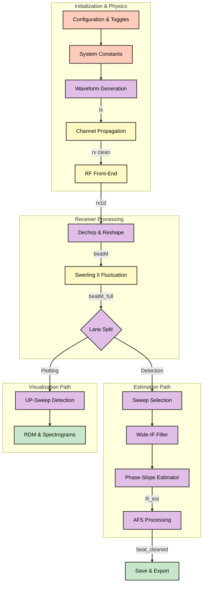
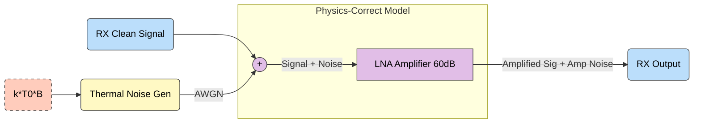
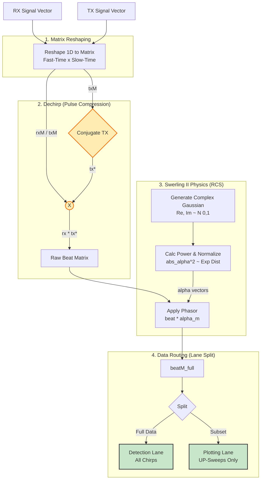
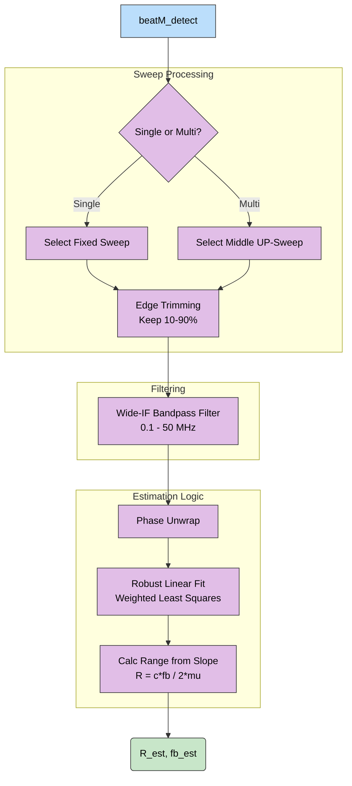
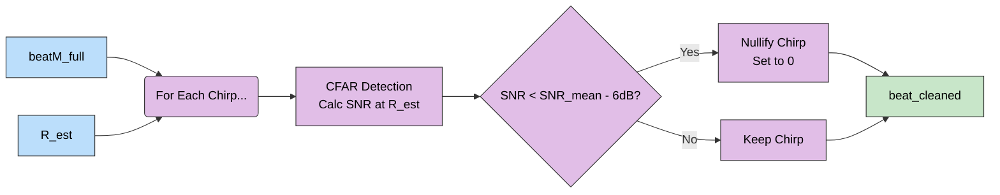
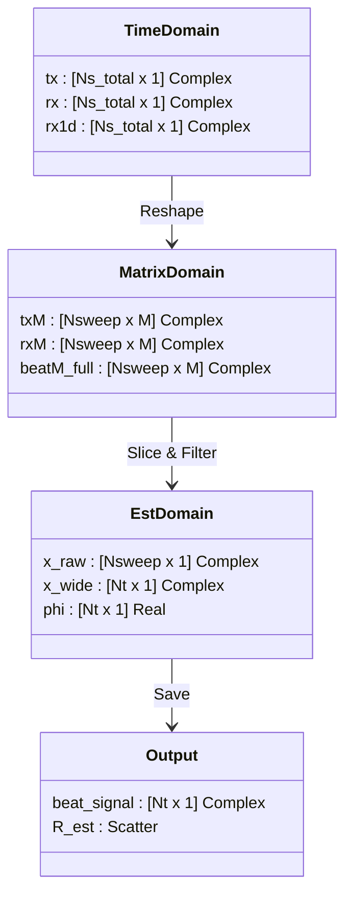

# FMCW Radar Signal Processing Chain - Visual Documentation

**Project**: Multi-Band Radar Fusion Research  
**Date**: February 4, 2026  
**Source**: `docs/signal_processing_chain.md` & `docs/model_fixes_feb2026.md`

This document provides a detailed visual breakdown of the signal processing interactions for the 5.8 GHz and 24 GHz FMCW radar models.

---

## 1. High-Level System Overview

The following diagram illustrates the complete end-to-end data flow from configuration to final range estimation.

---

## 2. Detailed Processing Stages

### Stage A: Waveform Generation & Propagation

The signal originates as a perfect baseband chirp and propagates through the environment, picking up delay and attenuation.

```mermaid
graph LR
    %% Styles - High Contrast
    classDef signal fill:#BBDEFB,stroke:#333,stroke-width:1px,color:black;
    classDef process fill:#E1BEE7,stroke:#333,stroke-width:1px,color:black;
    classDef physics fill:#FFF9C4,stroke:#333,stroke-width:1px,color:black;
    
    subgraph "1. Waveform Source"
        Gen[FMCW Generator<br>B=150MHz, T=3.33us]:::process
        Eq[Signal Model<br>exp j_pi_mu_t^2]:::process
    end

    subgraph "2. Transmission"
        TX_Ant[TX Antenna<br>Gain = +30dB]:::physics
        Prop1[Forward Path<br>Loss = 1/R^4]:::physics
    end

    subgraph "3. Target Interaction"
        Target[UAV Target<br>RCS Re-radiation]:::physics
    end

    subgraph "4. Reception"
        Prop2[Return Path<br>Delay = 2R/c]:::physics
        RX_Ant[RX Antenna<br>Capture Echo]:::physics
        Signal[RX Signal<br>s_rx t]:::signal
    end

    %% Flow
    Gen --> Eq --> TX_Ant
    TX_Ant -->|Radiated Wave| Prop1
    Prop1 -->|Incident Wave| Target
    Target -->|Reflected Wave| Prop2
    Prop2 -->|Echo| RX_Ant
    RX_Ant --> Signal
```

### Stage B: RF Front-End (Input-Referred Noise)

**CRITICAL**: Noise is added **before** amplification to correctly model physical thermal noise.

### Stage C: Dechirp & Swerling II Model

This stage performs three critical functions: 
1.  **Dechirping**: Compresses the wideband chirp into a narrowband beat frequency.
2.  **Swerling II Physics**: Applies frame-to-frame RCS fluctuations (decorrelated per chirp).
3.  **Lane Splitting**: Separates data for processing (all chirps) vs visualization (UP-chirps only).

**Physics Note**: The "Dechirp" operation ($RX \cdot TX^*$) mathematically extracts the range delay as a frequency shift ($f_b$). The Swerling model then modulates this clean signal with a stochastic complex gain ($\alpha$) to simulate a fluctuating target cross-section.

### Stage D: Range Estimation (Phase-Slope Method)

The primary estimator uses the phase slope of the beat signal, which is more robust than FFT peak picking for short-range FMCW.

### Stage E: Adaptive Fusion Selection (AFS)

AFS filters out chirps that have low SNR due to RCS nulls (deep fades), preparing the data for clean fusion.

---

## 3. Data Flow & Dimensions

The following diagram tracks the shape and type of the signal as it moves through the pipeline.

***

**End of Visual Documentation**
