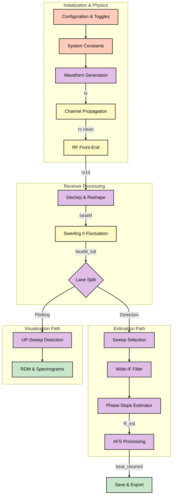
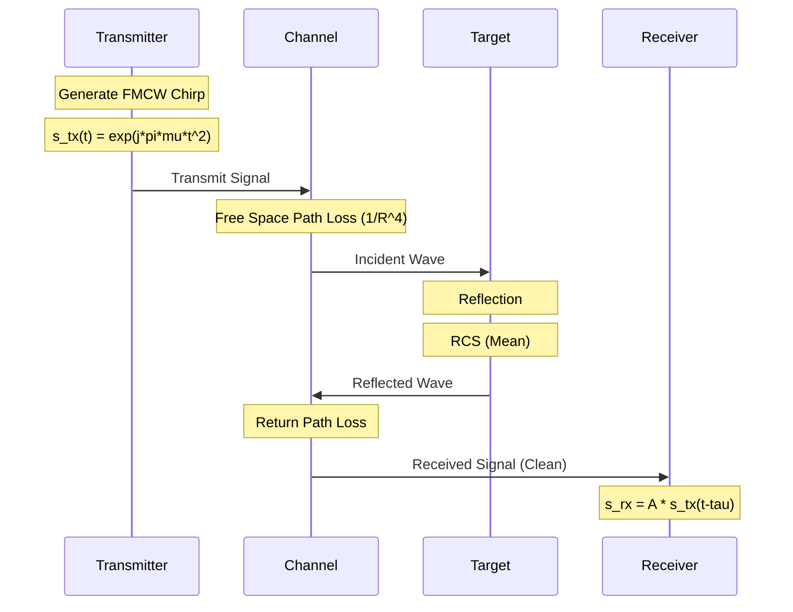
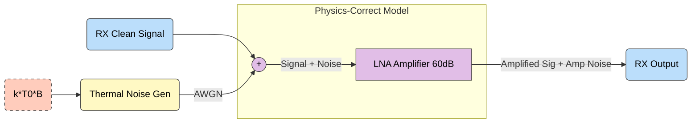
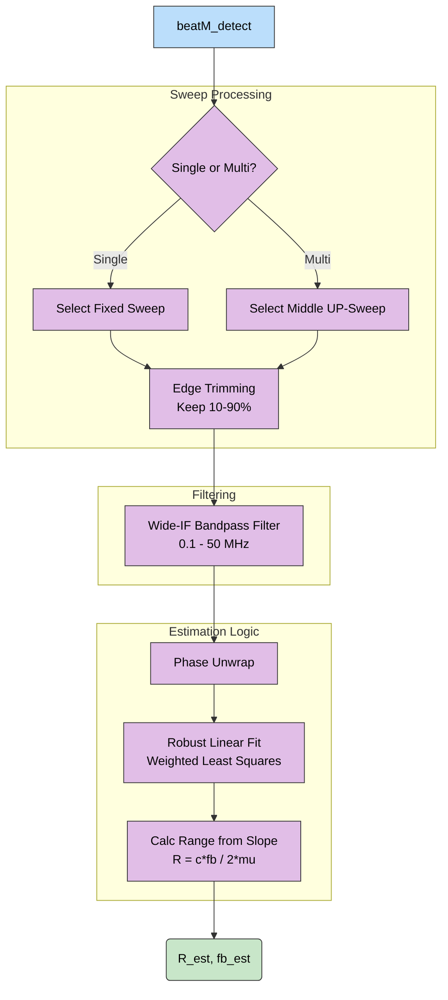
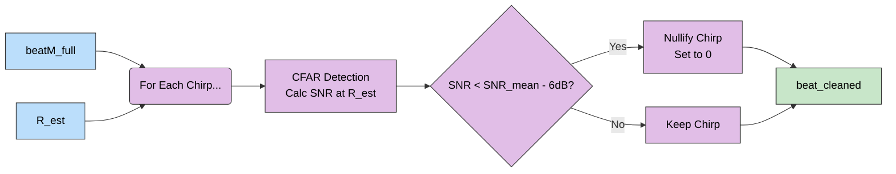
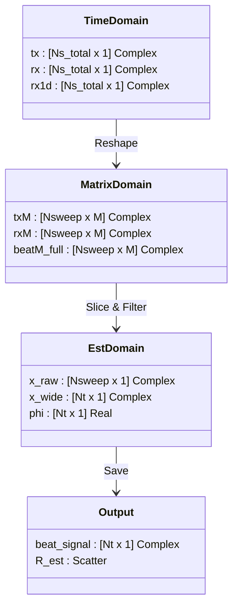

# FMCW Radar Signal Processing Chain - Visual Documentation

**Project**: Multi-Band Radar Fusion Research  
**Date**: February 4, 2026  
**Source**: `docs/signal_processing_chain.md` & `docs/model_fixes_feb2026.md`

This document provides a detailed visual breakdown of the signal processing interactions for the 5.8 GHz and 24 GHz FMCW radar models.

---

## 1. High-Level System Overview

The following diagram illustrates the complete end-to-end data flow from configuration to final range estimation.



---

## 2. Detailed Processing Stages

### Stage A: Waveform Generation & Propagation

The signal originates as a perfect baseband chirp and propagates through the environment, picking up delay and attenuation.



### Stage B: RF Front-End (Input-Referred Noise)

**CRITICAL**: Noise is added **before** amplification to correctly model physical thermal noise.



### Stage C: Dechirp & Swerling II Model

This stage converts the time-domain signal into the beat-frequency domain and applies statistical RCS fluctuations.

```mermaid
graph TB
    %% Inputs
    RX1D[rx1d Input Vector]:::signal
    TX1D[tx1d Input Vector]:::signal
    
    %% reshaping
    Reshape[Reshape to Matrix<br>Nsweep x M]:::process
    
    %% Dechirp
    DechirpNode[Dechirp Operation<br>beat = rx * conj_tx]:::process
    
    %% Swerling Branch
    SwerlingGen[Swerling II Generator]:::physics
    Alpha[Generate Alpha Gain<br>|alpha|^2 ~ Exp_1]:::physics
    
    %% Mixing
    ApplyFluct[Apply Fluctuation<br>beatM * alpha]:::process
    
    %% Output
    BeatFull[beatM_full Matrix]:::signal

    %% Connections
    RX1D --> Reshape
    TX1D --> Reshape
    Reshape --> DechirpNode
    DechirpNode --> ApplyFluct
    SwerlingGen --> Alpha --> ApplyFluct
    ApplyFluct --> BeatFull
    
    %% Styles - High Contrast
    classDef signal fill:#BBDEFB,stroke:#333,stroke-width:1px,color:black;
    classDef process fill:#E1BEE7,stroke:#333,stroke-width:1px,color:black;
    classDef physics fill:#FFF9C4,stroke:#333,stroke-width:1px,color:black;
```

### Stage D: Range Estimation (Phase-Slope Method)

The primary estimator uses the phase slope of the beat signal, which is more robust than FFT peak picking for short-range FMCW.



### Stage E: Adaptive Fusion Selection (AFS)

AFS filters out chirps that have low SNR due to RCS nulls (deep fades), preparing the data for clean fusion.



---

## 3. Data Flow & Dimensions

The following diagram tracks the shape and type of the signal as it moves through the pipeline.



***

**End of Visual Documentation**
